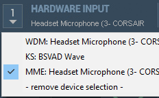
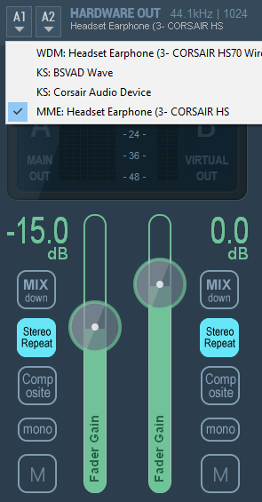
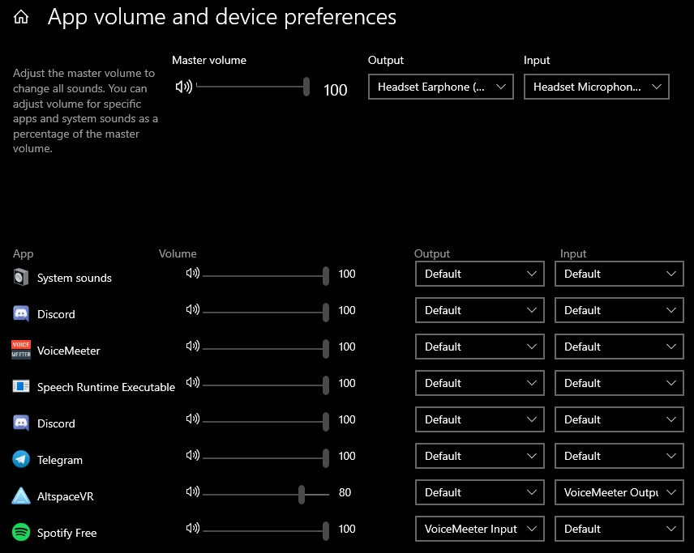

<h1>Voice Meeter Setup Instructions</h1>

These instructions will be for setting up voice meeter, which you can get from <a href="https://www.vb-audio.com/Voicemeeter/index.htm" target="_blank">here</a>. Once installed you have to set up the inputs and outputs in voice meeter.

You'll have to select the input 1 to your microphone. It's vital that you select the MME option for your microphone, similar to what is pictured below. It's also important to make sure A is unselected or you'll hear the microphone playing back to yourself.

After that you'll have to set the output in voice meeter simarly to how you set up the input. It's also good to turn on stereo repeat so as not to compromise audio quality. The slider on the left is what you hear and the slider on the right is what the application hears.

Once the inputs and outputs are configured correctly, you'll have to set the outputs and inputs for the program. This is done in Window's settings. Open the start menu and select the cog wheel, then select system, and on the left list select sound. Scroll down and select app volume and device preferences. This will take you to a page that looks like the one pictured below.

As you'll see in the image above, I have Spotify's output set to voice meeter input. Whatever program's audio you're trying to play must be set like this. If the program you're trying to play into doesn't have a mic selection you'll have to set the input to voice meeter output, like what I've done with AltspaceVR.
